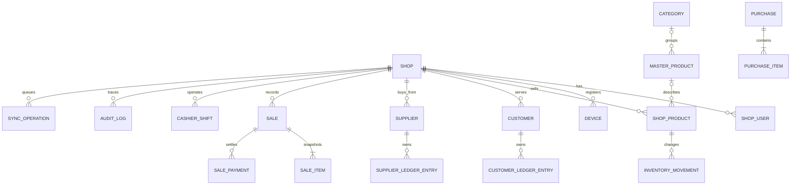

# Dukaan Pro architecture

## Scope and responsibilities

Dukaan Pro is an offline-first, multi-tenant Flutter application for Android cashier tablets, Windows counters, and later owner mobile workflows. Flutter owns presentation and application orchestration. Drift/SQLite is the immediate operational database and the only dependency of cashier billing. Supabase will later provide Auth, PostgreSQL with row-level security, Storage, and cross-device synchronization. Firebase Cloud Messaging is reserved for later owner notifications.

Every shop-owned record carries `shop_id`, including child transaction rows. Repositories are constructed with a required shop identifier and apply it to every read and validate it on writes. This is defense in depth; Supabase RLS must independently enforce the same boundary in Phase 1.

Roles are `owner` and `cashier`. Authorization belongs in an application policy layer later; hiding UI is not sufficient security. Cashiers will not receive profit, settings, subscription, or destructive transaction permissions.

## Domain decisions

- IDs are client-generated UUID v7 strings. Invoice numbers are separate display identifiers.
- Money is integer PKR minor units (paisa). No `double` represents money.
- Quantities and stock thresholds are integers scaled by 1,000, allowing three decimal places without binary floating-point drift. `1 item = 1000`.
- Completed sales are immutable history. Corrections become void/return/refund records and compensating ledger or inventory movements.
- Sale items copy product name, barcode, cost, and sale price snapshots. Product edits cannot rewrite invoices.
- Inventory is derived from append-only movements. Purchases/opening/returns add; sales/damage subtract; adjustment and correction quantities carry an explicit sign.
- Customer balance is derived from ledger entries. Opening balance, credit sale, and positive adjustment increase receivable; payment and refund decrease it.
- Supplier balance follows the equivalent payable ledger convention: opening/purchase/positive adjustment increase the amount owed; payment/refund decrease it.
- A master product is reusable global catalogue data. A shop product stores local pricing, tracking, and optional custom identity. Local rows store image paths only, never image bytes.

## ER overview

Image resolution is `Supabase Storage path -> compressed local thumbnail/cache -> placeholder`. Missing media never blocks product lookup or billing. Configuration uses compile-time `--dart-define=SUPABASE_URL=...` and `SUPABASE_ANON_KEY`; a service-role key must never ship in the app.

## Phase 1 identity and bootstrap

Supabase now provides owner email/password Auth, PostgreSQL RLS, and transactional bootstrap/sale RPCs. Owners are Auth users. Cashiers are shop-local identities and are not forced to own external email accounts. Their PINs are bcrypt-hashed only in PostgreSQL through an owner-only RPC; local SQLite stores no PIN or hash. Cashier session issuance remains a later trusted server flow, so no insecure cashier RLS policy exists.

Startup follows `auth gate -> membership lookup -> transactional shop creation when empty -> app-scoped device registration -> foundation home`. See [Auth and RLS](auth-and-rls.md).

## Product management

The shared `master_products` catalog owns reusable identity, brand, barcode,
category, unit, pack label, and image reference. `shop_products` owns pricing,
thresholds, activation, and optional custom identity fields. A partial unique
index prevents a shop from adding one master product twice. Owner-only RPCs
atomically create the shop product, its optional opening movement, and an audit
entry. Cashiers receive only the read-only POS lookup; management is reached
from the authenticated owner/device screen.

## Customers and Khata

Owners manage customer profiles through an authenticated owner RPC. Cashiers
see only active customers in checkout and can record cash/digital receipts from
the Khata screen; they cannot edit customer profiles or historical entries.
Credit sales continue through `LocalSaleService`, so split tenders post only
their Udhaar component. Before commit, the UI shows current balance, this sale,
projected balance, and the configured limit. The local service and a PostgreSQL
insert trigger both block limit violations; the owner action is to raise or
remove the limit in customer management.

Customer statements are projections of append-only ledger rows. Positive
magnitudes are signed by type: credit/opening debt is positive and payments or
refunds are negative. Receive-payment writes reuse the durable sync queue and
cashier-session/device authorization used by sales.

## Suppliers and purchases

Procurement is owner-only and lives outside the cashier POS workspace. Supplier
profiles are mutable reference data; purchases, stock movements, supplier
ledger entries, payments, and audit rows are immutable history. A partially
paid purchase posts only `total - paid` as payable. Product names and unit costs
are snapshotted on purchase items, while current stock continues to derive from
inventory movements using thousandth quantities.

## Expenses

Operating expenses are separate from resale-inventory purchases. Owners record
positive integer-paisa cash or digital expenses against tenant categories.
Expense history is immutable and auditable; future correction support must use
a void/reversal rather than an update or delete. Date/category/payment indexes
prepare the raw history for later reporting without building dashboard
projections in this phase.
# Owner reporting

The owner dashboard is a read-only feature layer over Drift. Reporting queries
are shop-scoped and derive values from immutable sales, purchase, expense,
inventory, and ledger rows. See [reporting.md](reporting.md) for definitions and
time-boundary rules. A guarded Supabase summary RPC provides a future remote
reconciliation path without changing the offline-first dependency direction.
